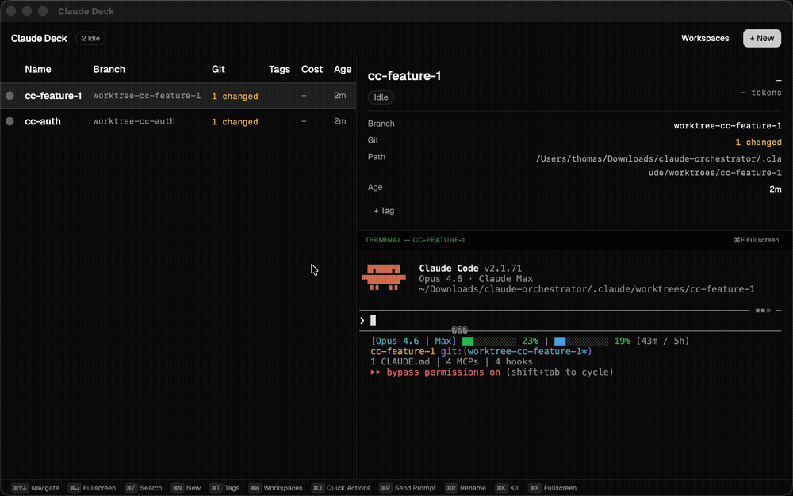

# Claude Deck App

[](https://github.com/ThomasTartrau/claude-deck/actions/workflows/ci.yml) [](../LICENSE)

Desktop application for managing multiple [Claude Code](https://docs.anthropic.com/en/docs/claude-code) sessions. Built with [Tauri](https://tauri.app) + React.



## Features

- **Session table** — View all Claude Code sessions with status, tags, git info, and cost
- **Embedded terminal** — Interactive PTY connected to any session, with fullscreen mode
- **Launch dialog** — Start new sessions with name, prompt, and workspace selection
- **Quick actions** — Save and replay prompt templates across sessions
- **Tags** — Organize sessions with tags, filter by tag
- **Workspaces** — Group sessions by project directory
- **Search & filter** — Find sessions by name, tags, or workspace
- **Send prompt** — Send text to any running session
- **Rename & kill** — Manage sessions from the UI

## Keyboard shortcuts

| Shortcut | Action |
|----------|--------|
| `⌘↑` / `⌘↓` | Navigate sessions |
| `⌘Enter` | Toggle fullscreen terminal |
| `⌘N` | New session |
| `⌘P` | Send prompt |
| `⌘T` | Tags |
| `⌘W` | Workspaces |
| `⌘J` | Quick actions |
| `⌘R` | Rename |
| `⌘K` | Kill session |
| `⌘/` | Search |
| `⌘F` | Fullscreen |

## Install

```bash
brew install --cask ThomasTartrau/claude-deck/claude-deck
```

Or download from [Releases](https://github.com/ThomasTartrau/claude-deck/releases) (macOS, Linux).

### Prerequisites

- [tmux](https://github.com/tmux/tmux) (sessions run inside tmux)
- [Claude Code](https://docs.anthropic.com/en/docs/claude-code) CLI installed

## Development

```bash
cd app
pnpm install
pnpm tauri dev
```

## License

[MIT](../LICENSE)
